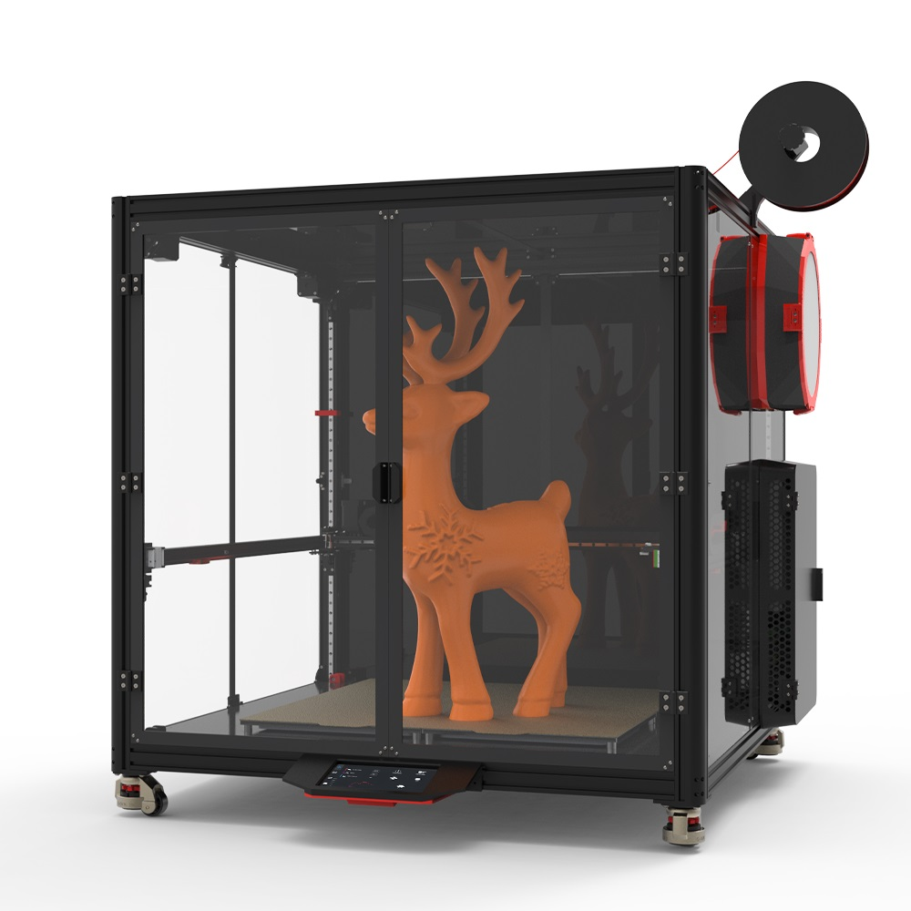

# Introduction

The Venture XL, a 600mm3 coreXY printer kit, is inspired by the classic VORON V2.4. The key components of this kit are high-precision CNC-machined parts, demonstrating outstanding quality. Meanwhile, it comes with the necessary printing components and tools considerately, and the print head and control box have been pre - assembled, enabling you to start the installation process effortlessly without the need to prepare additional parts. Once the installation is completed, you can immediately engage in the printing work and enjoy an efficient and convenient printing experience.

It is equipped with a 550Mhz H723 single - chip microcomputer, an RK3568 with 4 cores at 2.0GHz, 2GB + 32GB for the host computer, a TMC5160 high - performance stepper motor driver, and a 7 - inch high - definition capacitive touch screen. With a printing speed of up to 500m/s and an acceleration of 50000, it not only brings an extremely fast printing experience but also creates a comfortable operation feeling for you.

The size of the machine frame is designed with reserved installation spaces for IDEX and AWD, providing you with broad possibilities for upgrade and modification, which is highly playable. Whether you are pursuing higher performance or personalized customization, you can find satisfaction here.

In addition, the complete enclosure design provides an insulated space for the printer, effectively maintaining the stability of the printing environment. At the same time, it also has powerful air - purification capabilities. It can support the printing of various consumables and, more importantly, minimize the potential threat of plastic particles to your health to the greatest extent, creating a safe and comfortable printing environment for you.

# Fetrues

## Electronics：

- RK3568 (2+32GB) 4 core A55 2.0GHz Host
- Spider Pro 2.0 Controller, 550Hz H723
- SB Comobo V2 control board (Via CABUS)
- 7-inch FHD optically bonded capacitive touch screen
- RGB lighting system , Horizontal RGB lighting (84 LEDs) & SB LOGO RGB (10 LEDs) & Vertical RGB lighting (2x84 LEDs)
- Dual 350W PSU, 48V+24V
- BIG5160+TMC2209 stepper motor driver
- High-power 63A/40A contactor
- Four-zone independent control hot bed
- Pre-assembled independent control box
- 4xZ reduction motor
- 2.5A high temperature, high torque XY motor
- Cartographer 3D Eddy Current Sensor
- Filament sensor
- Logitech C270 Camera 

## Mechanical

- Super large size: 900x900x900mm, can meet AWD or IDEX upgrade modification;

- Enclosed cavity, more materials can be printed, healthier printing method, the box is sealed by segmented assembly, easy to install and ensure structural strength;

- Compatible with Nevermore StealthMax air filter, the air quality in the box is guaranteed to be pollution-free when the box is sealed;

- 4040 aluminum profile frame, light and high strength;

- CNC precision-machined independent four-zone printing platform, can be fine-tuned according to flatness;

- Drag chain system;

- 12mm linear guide, 9mm super wear-resistant belt;

- Aluminum alloy external electric control box that can be placed arbitrarily (left/right/back), connect the line;

- CNC aluminum alloy link components to ensure the structural strength of the equipment;

- Z-axis 27:1 reduction motor ensures that the Z-axis is more stable and does not slip when the machine is running or stopped;

- IDMCNC metal bracket can withstand high temperature challenges and ensure stability. In a high-temperature printing environment, it will not deform or fail, ensuring long-lasting and reliable performance. The bracket weighs only 26g, which is lighter than TAP leveling and old-style proximity switches. The bracket weighs only 26g, which is lighter than TAP leveling and old-style proximity switches, reducing inertia and improving speed, accuracy and printing quality;

- Can hang 5KG large rolls of consumables, and there is no need to frequently replace consumables during printing;

- 40KG load Foma wheel allows the equipment to be stationed and transported at any time

# Bill of Materials

| Index | Sort                 | Component                                                    | Qty    |
| ----- | -------------------- | ------------------------------------------------------------ | ------ |
| 1     | Fasteners            | Venture XL Fasteners Pack                                    | 1 SET  |
| 2     | Motion               | GATES GT2 Open Belt LL-2GT-9 (9mm wide) - 3400mm             | 2 PCS  |
| 3     | Motion               | GATES GT2 Open Belt LL-2GT-9 (9mm wide) - 1800mm             | 4 PCS  |
| 4     | Motion               | GT2 20T Toothed Idler (8mm ID 9mm W)                         | 4 PCS  |
| 5     | Motion               | GT2 20T Toothed Idler (5mm ID 9mm W)                         | 2 PCS  |
| 6     | Motion               | F695-2RS Bearing                                             | 48 PCS |
| 7     | Motion               | 695-ZZ Bearing                                               | 24 PCS |
| 8     | Motion               | 5x29mm Shaft                                                 | 4 PCS  |
| 9     | Motion               | MGN9H Linear Rail and Carriage 720mm                         | 4 PCS  |
| 10    | Motion               | MGN9H Linear Rail and Carriage 760mm                         | 2 PCS  |
| 11    | Motion               | MGN12H Linear Rail and Carriage 760mm                        | 1 PCS  |
| 12    | Vibration Management | Universal Fomar Caster                                       | 4 PCS  |
| 13    | Electronics          | Stealthburner CAN Toolhead Board                             | 1 SET  |
| 14    | Electronics          | X AXIS ENDSTOP OMRON MICROSWITCH                             | 1 SET  |
| 15    | Electronics          | Y AXIS ENDSTOP OMRON MICROSWITCH                             | 1 SET  |
| 16    | Electronics          | Cartographer 3D Eddy Current Sensor                          | 1 SET  |
| 17    | Electronics          | NeoPixel RGBW Mini Button PCB LED                            | 1 SET  |
| 18    | Electronics          | Four-way solid state relay                                   | 1 PCS  |
| 19    | Electronics          | AC contactor                                                 | 1 PCS  |
| 20    | Electronics          | Rocker Switch                                                | 1 PCS  |
| 21    | Electronics          | AC pin socket                                                | 1 PCS  |
| 22    | Electronics          | 42HSC8418-19PG27S                                            | 4 PCS  |
| 23    | Electronics          | 42HSC8418-37                                                 | 2 PCS  |
| 24    | Electronics          | 40x40x10 Axial Fan (24V)  Dual Ball Bearing with heat sink   | 2 PCS  |
| 25    | Electronics          | G36HSY4405-6D-60(check [here](https://github.com/FYSETC/FYSETC-VORON-2.4-R2-Pro/tree/main/Docs/Stepper%20motor%20parameters)) | 1 PCS  |
| 26    | Electronics          | Meanwell 350W-24V Power supply                               | 1 PCS  |
| 27    | Electronics          | Meanwell350W-48V Power supply                                | 1 PCS  |
| 28    | Electronics          | 30x30x7 Axial Fan (24V)                                      | 1 PCS  |
| 29    | Electronics          | 40x40x10 Axial Fan (24V)  Dual Ball Bearing                  | 1 PCS  |
| 30    | Electronics          | 50x50x15 Centrifugal Fan (24V)  Dual Ball Bearing            | 1 PCS  |
| 31    | Electronics          | 90x90x15 Axial Fan (24V)  Dual Ball Bearing                  | 1 PCS  |
| 32    | Electronics          | Keystone CAT6 Insert                                         | 1 PCS  |
| 33    | Electronics          | Terminal block (one in, four out)                            | 1 PCS  |
| 34    | Electronics          | C13 Power Cord / NEMA5-20-C19                                | 1 PCS  |
| 35    | Electronics          | Gantry light bar power board                                 | 1 PCS  |
| 36    | Electronics          | Gantry light bar                                             | 1 PCS  |
| 37    | Electronics          | Lighting strips                                              | 1 PCS  |
| 38    | Electronics          | C270 Camera                                                  | 1 PCS  |
| 39    | Electronics          | Electronic box (assembled )                                  | 1 PCS  |
| 40    | Controller           | ~~sdcard 16GB~~                                              | 1 PCS  |
| 41    | Controller           | USB2.0 A-C cable &  USB3.0 A-A cable                         | 1 PCS  |
| 42    | Controller           | Spider_Pro_V1.0                                              | 1 PCS  |
| 43    | Controller           | TMC2209 Stepper Motor Driver                                 | 4 PCS  |
| 44    | Controller           | BIG 5160 Stepper Motor Driver                                | 2 PCS  |
| 45    | Controller           | 7-inch screen controller assembly set                        | 1 SET  |
| 46    | Frame                | OpenBuilds                                                   | 12 PCS |
| 47    | Frame                | Misumi sectional profile Kit（23 Pcs）                       | 1 SET  |
| 48    | Frame                | Sealing profile kit（12 Pcs）                                | 1 SET  |
| 49    | Misc                 | PTFE Tube (4mm OD 2mm ID) - 3m                               | 1 PCS  |
| 50    | Misc                 | 6x3mm Neodimium Magnet                                       | 12 PCS |
| 51    | Misc                 | Stealthburner kits                                           | 1 SET  |
| 52    | Misc                 | PH2.0 2/3/4 Pin Plastic shell                                | 1 SET  |
| 53    | Misc                 | XH2.54 2/3/4 Pin Plastic shell                               | 1 SET  |
| 54    | Mics                 | Zip ties                                                     | 1 SET  |
| 55    | Mics                 | Saddle type cable tie holder                                 | 1 SET  |
| 56    | Cables               | Cable Kit（Pre-crimped terminals and longer wire lengths with label） | 1 SET  |
| 57    | Cables               | VORON Chain Kit (10X10mm)                                    | 3 PCS  |
| 58    | Panels               | Bottom / Back / Side / Front / Top / Electric box Panels     | 13 PCS |
| 59    | Buildplate           | 6061 Plate - 302X302x5mm （Surface milling improve flatness） | 4 PCS  |
| 60    | Buildplate           | Silicone AC Heater - 250x250mm (450W)+Thermal Fuse RH15A125（Pluggable） | 4 PCS  |
| 61    | Buildplate           | JanusBPS Textured steel plate 605 x 605mm （Double-sided powder gold） | 1 PCS  |
| 62    | Buildplate           | Scratch-proof Magnetic stickers 300X300mm thickness 1.5mm    | 1 PCS  |
| 63    | Buildplate           | Hotbed Insulation cotton thickness 5mm                       | 1 PCS  |
| 64    | Buildplate           | VORON hot bed PEI limit baffle                               | 1 PCS  |
| 65    | Buildplate           | VORON Hotbed nylon column                                    | 1 SET  |
| 66    | Buildplate           | Hot bed leveling spring                                      | 1 SET  |
| 67    | Buildplate           | VORON IDM Scanner CNC 9mm belt                               | 1 SET  |
| 68    | Tool                 | Electric soldering iron（With 500mm tin wire）               | 1 PCS  |
| 69    | Tool                 | Heat-inserted nut kit                                        | 1 SET  |
| 70    | Tool                 | Cutting pliers                                               | 1 PCS  |
| 71    | Tool                 | Tweezers                                                     | 1 PCS  |
| 72    | Tool                 | Screwdriver (Phillips/Slotted)                               | 1 SET  |
| 73    | Tool                 | Hexagonal wrenchs                                            | 1 SET  |
| 74    | Tool                 | Thermal silica                                               | 1 PCS  |
| 75    | Tool                 | Key Puller                                                   | 1 PCS  |
| 76    | Misc                 | 3M VHB Tape 5952                                             | 1 PCS  |
| 77    | Tool                 | Shielding tape                                               | 1 PCS  |
| 78    | Tool                 | Acetate cloth tape                                           | 1 PCS  |
| 79    | Tool                 | Steel brush                                                  | 1 PCS  |
| 80    | Mics                 | Nevermore StealthMax                                         | 1 SET  |
| 81    | Mics                 | Hinge                                                        | 8 PCS  |
| 82    | Mics                 | Braided Sleeve                                               | 1 SET  |
| 83    | Mics                 | Aluminum profile flat sealing strip                          | 1 SET  |
| 84    | Mics                 | The standby line 3m                                          | 1 PCS  |

# To Do Task

As an open source machine, it has unlimited possibilities. We will do our best to improve its information and tutorials. At the same time, we also invite professional players to contribute their ideas and strength. Below is part of our task progress, welcome to claim it.

|  TASK  |   STATUS   |  Author    |
| ---- | ---- | ---- |
| Instruction manual: Paper wiring diagram included with the kit | [x] | FYSETC |
| Instruction manual: Quick guide to simple configuration included with the kit | [x] | FYSETC |
| Tutorial: Wiring tutorial | (i) | FYSETC |
| Tutorial: Structural installation video | [i] | FYSETC |
| Tutorial: Configuration tutorial | [x] | FYSETC |
| Tutorial: Common problems and solutions | (i) | FYSETC |
| Tutorial: Common slicing software configuration, Prusa Slicer / Bambu Slicer / Orca Slicer | [x] | FYSETC |
| Tutorial: Combo V2 USB usage guide | |  |
| Tutorial: AWD modification guide | | |
| Tutorial: IDEX modification tutorial | | |
| Tutorial: A more perfect wiring tutorial | (i) | Esoterical |
| Tutorial: Structural installation video | | |
| Tutorial: Wiring tutorial | | |
| Tutorial: Configuration tutorial | | |
| Evaluation: Speed limit | | |
| Evaluation: Common problems and solutions | | |

# Known issue

1.  Instructions for use of motor connection wire:
    Z0 and Z3 motors need to use 3.5m connecting wires, Z1 motor uses 1.85m connecting wires, and the connecting wires of Z2 motor and B motor are swapped to solve the problem of short connecting wire of B motor. A Motor connection line remains unchanged
    
2. Update Notes

   
| Column |images |Installation location |Download Link | |
| - | - | - | - | - |
|1 | |Manual page 26 | |The M3x40 motor mounting screws are a bit long, so you can use M3x38 instead, or add M3 washers and use M3x40 for installation. |
|2 | |Manual page 27 | |The M3x40 motor mounting screws are a bit long, so you can use M3x38 instead, or add M3 washers and use M3x40 for installation.  |
|3 | |Manual page 43 | |Added 4 pcs hot bed thermal fuse |
|4 | |Manual page 48 |[here](https://github.com/FYSETC/Venture_XL/blob/main/STLs/Need%20to%20print%20the%20document%20yourself/Stealthburner/Chain_Anchor_3_Hole_V2_Trident.STL) | |
|5 | |Manual page 48 |[here](https://github.com/FYSETC/Venture_XL/blob/main/STLs/Need%20to%20print%20the%20document%20yourself/Stealthburner/SB_Dragon_Cutting_Printhead_Back.STL) | |
|6 | |Manual page 49 |[here](https://github.com/FYSETC/Venture_XL/blob/main/STLs/Need%20to%20print%20the%20document%20yourself/Stealthburner/%7Ba%7DShuttle_x1.STL) | |
|7 | |Manual page 50 |[here](https://github.com/FYSETC/Venture_XL/blob/main/STLs/Need%20to%20print%20the%20document%20yourself/Stealthburner/SB_Dragon_Cutting_Printhead_Front.STL) | |
|8 |![[o]_stealthburner_LED_carrier_rev2.STL.png](https://github.com/FYSETC/Venture_XL/blob/main/images/Print%20file%20updates/%5Bo%5D_stealthburner_LED_carrier_rev2.STL.png?raw=true) |Manual page 52 |[here](https://github.com/FYSETC/Venture_XL/blob/main/STLs/Need%20to%20print%20the%20document%20yourself/Stealthburner/%5Bo%5D_stealthburner_LED_carrier_rev2.STL.stl) | |
|9 |![[a]_xy_joint_cable_bridge_2hole.stl.png](https://github.com/FYSETC/Venture_XL/blob/main/images/Print%20file%20updates/%5Ba%5D_xy_joint_cable_bridge_2hole.stl.png?raw=true) |Manual page 53 |[here](https://github.com/FYSETC/Venture_XL/blob/main/STLs/Need%20to%20print%20the%20document%20yourself/XY_Joints/%5Ba%5D_xy_joint_cable_bridge_2hole.stl.stl) | |
|10 | | | |Motor line repair |
|11 | |Manual page 59 |[here](https://github.com/FYSETC/Venture_XL/blob/main/STLs/Need%20to%20print%20the%20document%20yourself/Under%20Floor%20Wire%20Cover/Under%20Floor%20Wire%20Cover_1_x1.STL)  [here](https://github.com/FYSETC/Venture_XL/blob/main/STLs/Need%20to%20print%20the%20document%20yourself/Under%20Floor%20Wire%20Cover/Under%20Floor%20Wire%20Cover_2_x1.STL) |Add bottom cable cover |

**Please provide the order number to contact customer service to collect the supplementary accessory package.**

# Thanks to
Here I would like to express my gratitude and support to Esoterical、 RichardTHF and many others. Your suggestions have helped us a lot - you all have my most sincere thanks.

